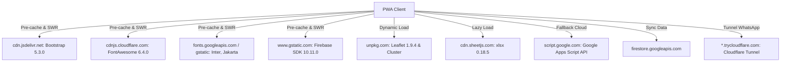

# 02 — Stack Tecnológico

**Sistema:** TCONTROL — Sistema de Gestión y Control Biométrico de Asistencia (2026)  
**Fecha de Análisis:** 2026-09-29  
**Estado:** [VERIFIED]  

---

## 1. Resumen Ejecutivo del Stack

El sistema TCONTROL está diseñado como una **Aplicación Web Progresiva (PWA) de arquitectura desacoplada y sin servidor tradicional (Serverless / Hybrid Cloud)**.  
No utiliza Node.js ni empaquetadores como Webpack o Vite en tiempo de ejecución de la web; se ejecuta directamente sobre Vanilla JavaScript moderno (ES6+) servido de forma estática en GitHub Pages, combinando dos motores de datos en la nube: **Google Cloud Firestore** (tiempo real y baja latencia) y **Google Apps Script / Google Sheets** (cálculos de nómina, fórmulas complejas y almacenamiento analítico a largo plazo). Adicionalmente, cuenta con un microservicio local en Python para la orquestación de mensajería WhatsApp.

```
┌────────────────────────────────────────────────────────┐
│                      FRONTEND                          │
│  - Vanilla JavaScript (ES6+ Native Modules / Scripts)  │
│  - HTML5 Semántico + CSS3 Variables (Dark/Light glass) │
│  - Service Worker v2.00 (Cache Storage API)            │
│  - Bootstrap 5.3.0 + Bootstrap Icons 1.11.0            │
│  - FontAwesome 6.4.0                                   │
│  - Leaflet 1.9.4 + MarkerCluster 1.4.1                 │
│  - SheetJS (xlsx 0.18.5) + jsPDF (Lazy Loaded)         │
└──────────────────────────┬─────────────────────────────┘
                           │
             ┌─────────────┴─────────────┐
             ▼                           ▼
┌──────────────────────────┐┌──────────────────────────┐
│     CLOUD BACKEND 1      ││     CLOUD BACKEND 2      │
│ Google Cloud Firestore   ││ Google Apps Script (V8)  │
│ - SDK: JS Compat v10.11.0││ - Google Workspace APIs  │
│ - Long-Polling Fallback  ││ - Google Sheets Engine   │
│ - Reglas Security v2     ││ - JSONP & POST REST APIs │
└──────────────────────────┘└──────────────────────────┘
             │
             ▼
┌──────────────────────────────────────────────────────┐
│            MICROSERVICIO LOCAL DE WHATSAPP           │
│ - Python 3 (ThreadingHTTPServer / Urllib)            │
│ - OpenWA / WAHA API (Puerto local 2785)              │
│ - CORS Proxy Bridge (Puerto local 2786)              │
│ - Cloudflare Tunnel (cloudflared.exe -> trycloudflare)│
└──────────────────────────────────────────────────────┘
```

---

## 2. Tecnologías y Runtimes por Capa

### 2.1 Capa de Cliente / Frontend (PWA)

| Componente | Tecnología | Versión | Tipo de Verificación | Evidencia en el Código |
|---|---|---|---|---|
| **Lenguaje Base** | ECMAScript (JavaScript) | ES2020+ | [VERIFIED] | Uso de `async/await`, `Promise.allSettled`, Optional Chaining (`?.`), Nullish Coalescing (`??`), Canvas API y Web Cryptography API (`crypto.subtle`) |
| **Estructura** | HTML5 Semántico | 5.0 | [VERIFIED] | `index.html`, `supervisor.html`, etc. con meta tags PWA y viewport-fit |
| **Estilos** | CSS3 Vanilla con Custom Properties | Nivel 3 | [VERIFIED] | Variables globales `:root { --red: #dc2626; --bg: #0f172a; ... }` en `CSS/*.css` |
| **Offline Engine** | Service Worker API | Cache `tcontrol-v2.00` | [VERIFIED] | `sw.js:L7` |
| **Framework UI** | Bootstrap | 5.3.0 | [VERIFIED] | `index.html:L27`, `supervisor.html:L12` (`cdn.jsdelivr.net/npm/bootstrap@5.3.0`) |
| **Librería de Íconos 1** | FontAwesome Free | 6.4.0 | [VERIFIED] | `index.html:L30`, `supervisor.html:L11` (`cdnjs.cloudflare.com/.../font-awesome/6.4.0`) |
| **Librería de Íconos 2** | Bootstrap Icons | 1.11.0 | [VERIFIED] | `guardia.html:L13`, `catering.html:L9` |
| **Motor Cartográfico** | Leaflet | 1.9.4 | [VERIFIED] | `ubicacion.html:L15,120` (`unpkg.com/leaflet@1.9.4`) |
| **Clustering de Mapas** | Leaflet MarkerCluster | 1.4.1 | [VERIFIED] | `ubicacion.html:L16,121` (`unpkg.com/leaflet.markercluster@1.4.1`) |
| **Exportación Excel** | SheetJS (xlsx.full.min.js) | 0.18.5 | [VERIFIED] | Invocación dinámica en `supervisor_reportes_custom.js` (`cdn.sheetjs.com/xlsx-0.18.5`) |
| **Exportación PDF** | jsPDF + autoTable | 2.5.1 / 3.5.28 | [VERIFIED] | Invocación bajo demanda en `supervisor_reportes_custom.js` |
| **Tipografías Web** | Google Fonts | Inter, Plus Jakarta Sans, Outfit, Fira Code | [VERIFIED] | `sw.js:L28-29`, `supervisor.html:L9-10`, `ubicacion.html:L12` |

---

### 2.2 Capa de Datos y Persistencia

#### A. Google Cloud Firestore
- **Proyecto ID:** `tcontrol-asistencia` (`JS/firebase_backend.js:L9`)
- **SDK Utilizado:** Firebase JavaScript SDK v10.11.0 (Compat Build) (`JS/firebase_backend.js:L30-31`)
- **Modo de Conexión:** Forzado a `experimentalForceLongPolling: true` (`JS/firebase_backend.js:L21`) para evitar bloqueos por cortafuegos corporativos o proxys restrictivos en redes móviles y empresariales.
- **Reglas de Seguridad:** Reglas nativas declaradas en `firestore.rules` con versión 2 (`rules_version = '2';`).
- **Autenticación en Firestore:** Acceso de lectura/escritura directo mediante API Key web pública de Firebase (`[REDACTED]`), protegido a nivel de reglas por validación de esquemas y restricciones de borrado.

#### B. Google Apps Script / Google Sheets
- **Runtime:** Apps Script V8 Modern Runtime (`backend/apps_script/*.gs`)
- **ID de Aplicación / Endpoint:** `AKfycbxgmtQXWi-qDYyjT8kG6jsIEWZPbXXcHtLMaYqTlx2Allv7qkb9oe6ZGYt6lP6lCPZb` (`JS/tcontrol_core.js:L8`, `JS/config.js:L4`)
- **Mecanismo de Comunicación:** Peticiones GET encapsuladas en JSONP dinámico (`<script src="...">` con función de callback) para eludir las restricciones de CORS del navegador, y peticiones POST JSON con `ContentService` para archivado y sincronización masiva.
- **Seguridad en Apps Script:** Validación por cabecera y parámetro de clave secreta institucional: `apiKey: '[REDACTED]'` (`backend/apps_script/api_completa.gs:L138,178`).

---

### 2.3 Capa de Integración WhatsApp (Microservicio Híbrido)

| Parámetro | Valor / Tecnología | Evidencia |
|---|---|---|
| **Lenguaje del Orquestador** | Python | [VERIFIED] `services/whatsapp/iniciar_tunel.py` |
| **Versión de Python** | Python 3.8+ (Windows 64-bit) | [VERIFIED] Uso de f-strings, subprocess y urllib nativo |
| **Servidor de Mensajería WhatsApp** | OpenWA / WAHA (WhatsApp HTTP API) | [VERIFIED] Endpoints `/api/sessions/{id}/messages/send-text`, `/send-image`, `/contacts/check/` (`JS/openwa_service.js:L593-620`) |
| **IP y Puerto Base OpenWA** | `http://192.168.10.129:2785` | [VERIFIED] `services/whatsapp/iniciar_tunel.py:L33` |
| **Proxy Inversor CORS** | `whatsapp_cors_bridge.py` | [VERIFIED] `http://127.0.0.1:2786` (`services/whatsapp/iniciar_tunel.py:L34`) |
| **Proveedor de Túnel Seguro** | Cloudflare Tunnel (`cloudflared.exe`) | [VERIFIED] `C:\Users\tcontrol\bin\cloudflared.exe` -> dominios dinámicos `*.trycloudflare.com` |
| **Sincronización en Tiempo Real** | Google Cloud Firestore REST API PATCH | [VERIFIED] Actualiza automáticamente el campo `servidorUrl` en `configuracion/whatsapp` al levantar el túnel |

---

### 2.4 Infraestructura y Hosting

| Entorno | Plataforma / Servicio | Configuración | Evidencia |
|---|---|---|---|
| **Hosting Frontend** | GitHub Pages | Dominio personalizado con SSL administrado | [VERIFIED] `CNAME` (`asistencia.tcontrolsa.com`) |
| **Persistencia Principal** | Google Firebase Firestore | Región: `us-central1` o `nam5` [INFERRED] | `tcontrol-asistencia.firebaseapp.com` |
| **Almacenamiento Multimedia** | Google Drive & Google User Content | Redirección de enlaces `/d/ID=w200` | [VERIFIED] `JS/tcontrol_core.js:L22-53` (`lh3.googleusercontent.com/d/{fileId}`) |
| **Servidor Local LAN** | Servidor Windows en red local | IP interna `192.168.10.129` | [VERIFIED] `openwa_service.js:L9,353` |

---

## 3. Matriz de Dependencias Externas (CDNs)

Todas las dependencias de librerías del cliente son consumidas vía CDNs de alta disponibilidad y cacheadas localmente por el Service Worker:



---

## 4. Estado de Verificación de Versiones

- **Comprobadas al 100% [VERIFIED]:**
  - Bootstrap: `5.3.0`
  - FontAwesome: `6.4.0`
  - Firebase SDK: `10.11.0`
  - Leaflet: `1.9.4`
  - MarkerCluster: `1.4.1`
  - Service Worker: `v2.00`
  - Config App: `1.0.0`
- **Sin gestor de paquetes formal (`package.json` ausente en raíz):**
  - No existe `package.json` ni `node_modules` en la raíz [VERIFIED]. El frontend es Vanilla Web estricto sin proceso de bundling o compilación intermedia.
