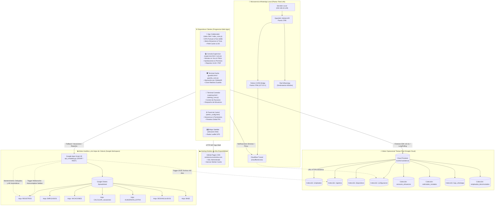
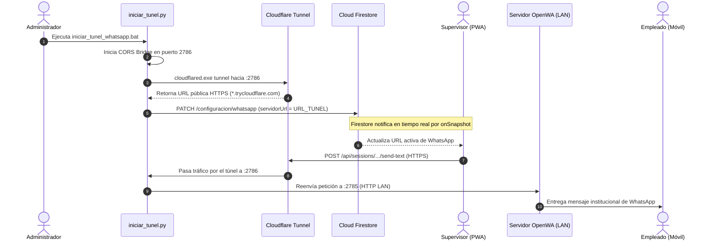
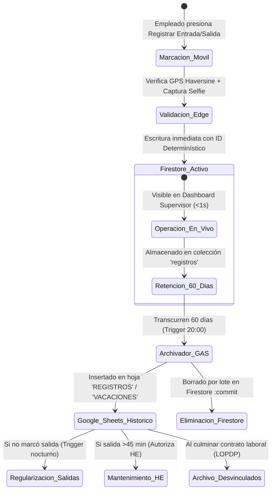

# 03 — Arquitectura del Sistema

**Sistema:** TCONTROL — Sistema de Gestión y Control Biométrico de Asistencia (2026)  
**Fecha de Análisis:** 2026-09-29  
**Estado:** [VERIFIED]  

---

## 1. Visión General de la Arquitectura

TCONTROL implementa un modelo **Híbrido Distribuido (Edge/Client-Heavy PWA + Dual Cloud Backend + Local IoT/Messaging Microservice)**.

La plataforma no utiliza un servidor web monolítico en NodeJS o Java. En su lugar, la lógica de negocio se ejecuta en tres capas cooperativas:
1. **Frontend Autónomo PWA (Edge):** El navegador del cliente procesa validaciones biométricas (selfie en canvas), distancias geodésicas (Haversine), cifrado local de claves (SHA-256) y almacenamiento local en `localStorage` y `CacheStorage`.
2. **Capa Cloud de Datos y Tiempo Real (Firestore):** Actúa como base de datos operacional de alta concurrencia y baja latencia para los últimos 60 días, con sincronización de eventos y escuchadores en vivo (`onSnapshot`).
3. **Capa Cloud Analítica y de Nómina (Google Apps Script + Google Sheets):** Actúa como data warehouse, motor de cálculo de nómina y archivador histórico a largo plazo (>60 días), ejecutando scripts programados (triggers de tiempo).
4. **Capa de Comunicación (OpenWA / WAHA + Túnel Cloudflare):** Un microservicio local en Python expone el motor de WhatsApp a través de un túnel seguro Cloudflare HTTPS con actualización dinámica en Firestore.

---

## 2. Diagrama General de Arquitectura (Topología de Componentes)



---

## 3. Desglose Detallado por Componente

### 3.1 Clientes PWA (Frontend)
- **App Empleado (`index.html` + `index_core.js`):**
  - Maneja la sesión persistente mediante `DEVICE_TOKEN` en `localStorage`.
  - Valida el PIN del empleado contra Firestore con hash SHA-256.
  - Al marcar, captura la geolocalización vía `navigator.geolocation.getCurrentPosition` (máxima precisión).
  - Calcula la distancia métrica a la base corporativa (`LAT_EMPRESA`, `LNG_EMPRESA`) o a la base asignada al colaborador (`baseLat`, `baseLng`) mediante la fórmula de Haversine. Si está fuera del radio permitido (`RADIO_METROS = 250m`), rechaza la marcación salvo en modalidad de campo autorizada.
  - Captura una foto instantánea desde la cámara frontal a través de un elemento `<video>` proyectado a `<canvas>` (redimensionado a calidad optimizada) para validación biométrica visual.
  - Guarda la marcación con clave determinística: `{empleadoId}_{tipo}_{fecha}_{horaLimpia}` para garantizar idempotencia y evitar duplicados.

- **Panel de Supervisión (`supervisor.html` + `supervisor_core.js` + submódulos):**
  - Consume la colección `registros` de Firestore filtrada por fecha de hoy o rangos seleccionados.
  - Recibe actualizaciones en vivo mediante escuchadores de Firestore (`onSnapshot`).
  - Cuando se consultan saldos de vacaciones históricos, invoca a Google Apps Script (`accion=obtenerVacacionesEmpleado`) con almacenamiento en caché local de 6 horas (`tcontrol_vacaciones_cache_v3`).
  - Permite autorizar horas extras, justificar ausencias médicas o personales y registrar permisos con deducción automática de minutos.

- **Terminal Guardia (`guardia.html` + `guardia_core.js`):**
  - Diseñado para operar en pantalla táctil en caseta de ingreso.
  - Protegido por clave fija (`CLAVE_GUARDIA = 'TCONTROL2026'`) o validación en Firestore.
  - Búsqueda en tiempo real de colaboradores por ID o cédula y marcación rápida.

- **Terminal Catering (`catering.html` + `catering_core.js`):**
  - Interfaz orientada al personal de comedor para visualizar en tiempo real los almuerzos confirmados hoy (Normal, Dieta, Vegetariano).
  - Al despachar una ración, actualiza la colección `consumo_almuerzos` registrando el timestamp del consumo para evitar duplicidades de plato.

---

### 3.2 Motor Operacional en Tiempo Real (Cloud Firestore)

Firestore opera como la base activa para el día a día:
1. **Latencia mínima:** Permite a los supervisores ver las marcaciones de los colaboradores en menos de 1 segundo tras ser ejecutadas.
2. **Idempotencia:** Los IDs de los documentos en la colección `registros` son generados mediante el algoritmo:
   ```text
   DOC_ID = empleadoId + "_" + tipo + "_" + fecha + "_" + horaSinDosPuntos
   ```
   Esto previene duplicados en caso de desconexiones o doble clic involuntario.
3. **Control de concurrencia y retención:** Los registros permanecen en Firestore durante **60 días continuos**. Al día 61, el proceso automatizado de Apps Script los transfiere al histórico de Google Sheets y los elimina de Firestore para mantener la base liviana y optimizar costos.

---

### 3.3 Motor Analítico, Nómina y Archivo (Google Apps Script + Sheets)

Google Sheets actúa como el repositorio contable y de auditoría patronal:
1. **Hojas de Cálculo Principales:**
   - `REGISTROS`: Archivo consolidado permanente con 25 columnas oficiales (A-Y).
   - `EMPLEADOS`: Catálogo maestro de personal (datos personales, cargo, área, base GPS, estado activo/inactivo).
   - `VACACIONES`: Bitácora histórica de goce de vacaciones por colaborador.
   - `CALCULAR_vacaciones`: Fórmulas de cálculo de días devengados, tomados y saldo disponible.
   - `DESVINCULADOS`: Archivo pasivo exigido por la normativa laboral y LOPDP.
   - `ALMUERZOS_EXTRA`: Registro de pedidos de alimentación para visitas y contratistas.
2. **Tareas Programadas (Triggers de Tiempo GAS):**
   - **`ejecutarArchivadoDiario()`:** Corre diariamente a las 20:00 (`archivador_diario.gs:L252`). Descarga registros de más de 60 días desde Firestore REST API, los escribe en `REGISTROS` / `VACACIONES` y los elimina de Firestore en lotes de 100 documentos mediante `:commit`.
   - **`autoCompletarSalidasFaltantesSheets()`:** Corre en la madrugada (`autocompletar_salidas.gs:L275`). Evalúa los últimos 7 días. Si un empleado tiene `ENTRADA` pero no `SALIDA`, inserta la salida oficial (16:15 en laborables, 15:15 en fines de semana).
   - **`ejecutarMantenimiento()`:** Sanitización, deduplicación, cálculo automático de horas extras y reporte de inconsistencias (`mantenimiento_registros.gs:L767`).

---

### 3.4 Microservicio de Mensajería WhatsApp (OpenWA + Túnel Cloudflare)

Para enviar mensajes de WhatsApp sin incurrir en costos elevados de la API oficial de Meta Cloud y mantener control total sobre las plantillas:
1. Se utiliza una instancia de OpenWA/WAHA corriendo en la red local (`http://192.168.10.129:2785`).
2. Debido a que la PWA se sirve en HTTPS seguro (`https://asistencia.tcontrolsa.com`), el navegador bloquearía cualquier petición directa a `http://192.168.10.129:2785` por **Mixed Content Policy** (Contenido Mixto).
3. Para resolver esto, el script `iniciar_tunel.py`:
   - Levanta un proxy inverso multihilo en `127.0.0.1:2786` (`whatsapp_cors_bridge.py`) que inyecta cabeceras CORS permisivas.
   - Inicia un túnel seguro con `cloudflared tunnel --url http://127.0.0.1:2786`.
   - Lee por stdout la URL generada (`https://*.trycloudflare.com`).
   - Envía un `PATCH` a Firestore REST API actualizando el campo `servidorUrl` en el documento `configuracion/whatsapp`.
   - Al cerrar el túnel (Ctrl+C), un manejador de señales (`SIGINT`/`SIGTERM`) restaura la URL en Firestore a la IP local interna.



---

## 4. Ciclo de Vida de los Datos (Data Lifecycle)



---

## 5. Patrones Arquitectónicos Identificados

1. **BFF (Backend-for-Frontend) Implícito:** `FirebaseBackend.procesarAccion` y `api_completa.gs` actúan como fachada universal, recibiendo un objeto `params` y distribuyendo a métodos específicos.
2. **Stale-While-Revalidate (SWR):** Implementado en el Service Worker para assets estáticos y en `FirebaseBackend` para el catálogo de vacaciones (`tcontrol_vacaciones_cache_v3`).
3. **Idempotent Document Identification:** Clave compuesta unívoca (`{id}_{tipo}_{fecha}_{hora}`) que asegura que peticiones duplicadas no creen registros múltiples.
4. **Circuit Breaker / Fallback Graceful:** Si Firestore falla o está desactivado, el sistema conmuta a JSONP contra Google Apps Script. Si la URL HTTPS del túnel de WhatsApp falla, conmuta automáticamente a la IP local si el cliente está en LAN.
5. **Decoupled Data Custody:** Separación estricta entre datos operativos volátiles (Firestore) y datos laborales legales de prescripción prolongada (Google Sheets / LOPDP).
