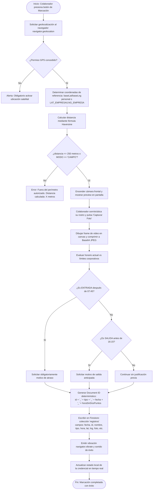
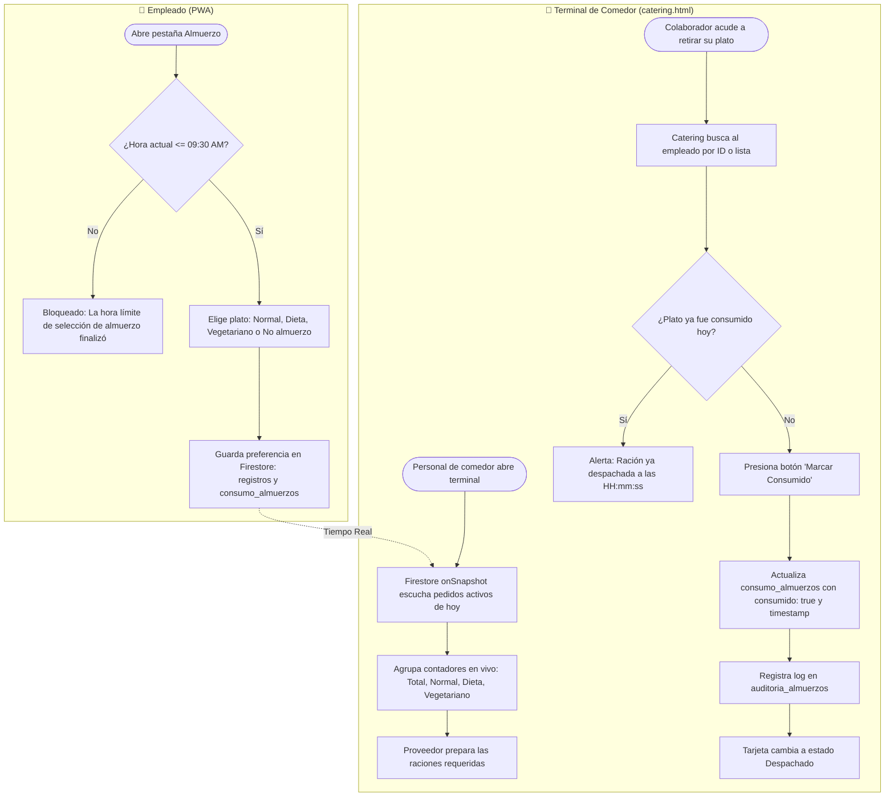
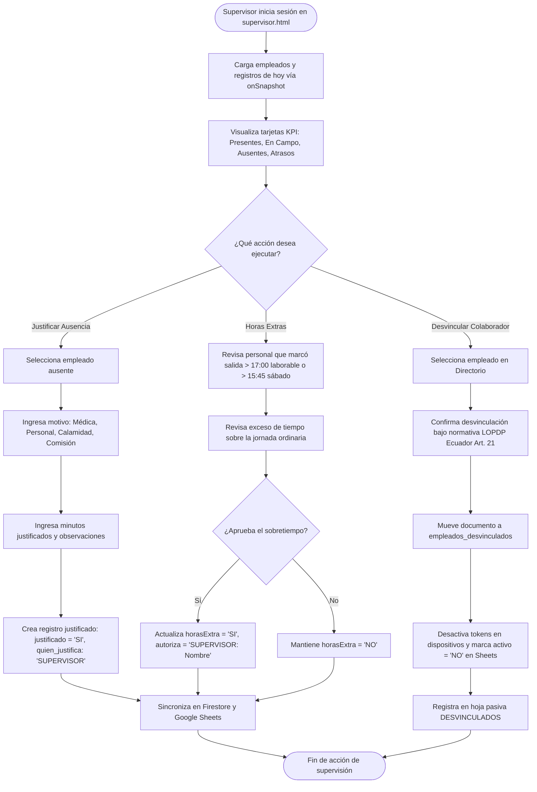

# 05 — Flujos de Negocio (Workflows)

**Sistema:** TCONTROL — Sistema de Gestión y Control Biométrico de Asistencia (2026)  
**Fecha de Análisis:** 2026-09-29  
**Estado:** [VERIFIED]  

---

## 1. Flujo de Enrolamiento y Registro de Dispositivo (Enrollment Flow)

Este flujo se ejecuta la primera vez que un colaborador abre la PWA en su dispositivo móvil o tras un borrado de cookies/reseteo de contraseñas.

```mermaid
flowchart TD
    A([Inicio: Colaborador abre index.html]) --> B{¿Existe TCONTROL_DEVICE_TOKEN en localStorage?}
    B -- Sí --> C[Consultar estado de token en Firestore: dispositivos/token]
    C --> D{¿Token registrado y activo?}
    D -- Sí --> E[Mostrar modal de ingreso de PIN numérico]
    E --> F[Ir a Flujo 2: Autenticación por PIN]
    
    B -- No --> G[Mostrar pantalla de Enrolamiento de Dispositivo]
    D -- No --> G
    
    G --> H[Colaborador ingresa Cédula / ID]
    H --> I[Consultar empleados/id en Firestore]
    I --> J{¿Empleado existe y activo == 'SI'?}
    J -- No --> K[Error: Colaborador inactivo o no encontrado. Contactar a RRHH]
    
    J -- Sí --> L{¿Empleado ya tiene PIN configurado?}
    L -- No --> M[Solicitar creación de PIN numérico de 4 dígitos y confirmación]
    M --> N{¿PIN coincide en ambas entradas?}
    N -- No --> M
    N -- Sí --> O[Generar SHA-256 de PIN]
    
    L -- Sí --> P[Solicitar PIN actual para vincular nuevo dispositivo]
    P --> Q{¿Hash de PIN coincide con el de Firestore?}
    Q -- No --> R[Error: PIN incorrecto]
    
    O --> S[Generar deviceToken con prefijo DEV_XXXX]
    Q -- Sí --> S
    
    S --> T[Batch write en Firestore: <br/>1. dispositivos/DEV_XXXX {id_empleado, activo:true}<br/>2. empleados/id {deviceToken, pin:hash}]
    T --> U[Guardar TCONTROL_DEVICE_TOKEN en localStorage]
    U --> V([Fin: Redirigir a Credencial Digital])
```

---

## 2. Flujo de Marcación Asistida por GPS y Selfie Biométrico

Workflow principal del colaborador para registrar su ingreso o egreso.



---

## 3. Flujo de Pedido, Conteo y Despacho de Almuerzos



---

## 4. Flujo de Supervisión, Horas Extras y Justificaciones



---

## 5. Flujo de Notificaciones WhatsApp Automatizadas (Túnel Cloudflare)

```mermaid
flowchart TD
    A([Evento: Supervisor pulsa 'Enviar Alerta de Ausencia' o recordatorio]) --> B[OpenWAService verifica estado del servidor WhatsApp]
    B --> C{¿La URL configurada es HTTPS o HTTP?}
    
    C -- HTTP y sitio en HTTPS --> D[Detecta Bloqueo de Contenido Mixto]
    D --> E[Consulta Firestore configuracion/whatsapp para refrescar URL dinámica]
    E --> F{¿Se obtuvo URL de Cloudflare *.trycloudflare.com?}
    F -- No --> G[Error: Ejecutar iniciar_tunel_whatsapp.bat en la estación base]
    F -- Sí --> H[Actualiza configuración local con URL HTTPS del túnel]
    
    C -- HTTPS --> H
    H --> I[Normaliza número telefónico: ej. 0984660105 -> 593984660105@c.us]
    I --> J[Reemplaza tokens de plantilla: {nombre}, {hora}, {fecha}, {link}]
    J --> K{¿Incluye imagen adjunta?}
    K -- Sí --> L[POST /api/sessions/{id}/messages/send-image con Base64]
    K -- No --> M[POST /api/sessions/{id}/messages/send-text con JSON]
    
    L --> N[Túnel Cloudflare transmite por puerto 2786 -> CORS Bridge -> 2785 OpenWA]
    M --> N
    N --> O{¿OpenWA entregó mensaje con éxito?}
    O -- Sí --> P[Registra evento exitoso en logs_whatsapp de Firestore]
    O -- No --> Q[Alerta en pantalla y reintento con endpoint alternativo]
    P --> R([Fin: Notificación entregada en WhatsApp del colaborador])
```

---

## 6. Flujo de Archivador Histórico Diario (>60 Días)

Ejecutado automáticamente por Google Apps Script a las 20:00 (`archivador_diario.gs`).

```mermaid
flowchart TD
    A([Trigger Diario GAS: 20:00]) --> B[Calcular fecha de corte: hoy - 60 días a las 00:00:00]
    B --> C[Descargar todos los documentos de Firestore /registros vía REST API paginada]
    C --> D[Iterar cada documento y parsear fecha/timestamp]
    
    D --> E{¿Fecha del registro es menor a la fecha de corte?}
    E -- No --> F[Conservar en Firestore: registro activo para consulta rápida]
    
    E -- Sí --> G{¿Tipo de registro es VACACIONES?}
    G -- Sí --> H[Formatear fila de 25 columnas para hoja 'VACACIONES']
    G -- No --> I[Formatear fila oficial de 25 columnas para hoja 'REGISTROS']
    
    H --> J[Añadir a lista de IDs a eliminar de Firestore]
    I --> J
    
    J --> K[Escribir en lote en Google Sheets: sheet.getRange().setValues()]
    K --> L[Dividir lista de eliminación en chunks de 100 documentos]
    L --> M[Ejecutar petición HTTP POST a Firestore REST API :commit con delete]
    M --> N{¿Código HTTP 200?}
    N -- Sí --> O[Registros eliminados de Firestore con éxito]
    N -- No --> P[Registrar advertencia en consola GAS]
    
    O --> Q([Fin del proceso de archivado diario])
    P --> Q
```

---

## 7. Flujo Nocturno de Regularización y Autocompletado de Salidas

Ejecutado por Google Apps Script en la madrugada (`autocompletar_salidas.gs`).

```mermaid
flowchart TD
    A([Trigger Nocturno GAS]) --> B[Paso 1: Regularizar salidas existentes en fines de semana a las 15:15:00]
    B --> C[Paso 2: Obtener fechas de los últimos 7 días excluyendo hoy]
    C --> D[Cargar catálogo de empleados activos excluyendo los marcados como SIN ASISTENCIA]
    D --> E[Escanear hoja REGISTROS y construir mapa de timbrados: {empleadoId_fecha}]
    
    E --> F[Para cada empleado y fecha evaluar si registró ENTRADA pero no SALIDA]
    F --> G{¿Tiene ENTRADA pero falta SALIDA?}
    G -- No --> H[Jornada cerrada correctamente o inasistencia completa]
    
    G -- Sí --> I{¿El día evaluado es fin de semana Sábado o Domingo?}
    I -- Sí --> J[Asignar hora de salida: 15:15:00]
    I -- No --> K[Asignar hora de salida: 16:15:00]
    
    J --> L[Crear fila con DISPOSITIVO = 'AUTO_COMPLETAR', QUIEN_JUSTIFICA = 'SISTEMA']
    K --> L
    L --> M[Insertar en lote en hoja REGISTROS]
    M --> N([Fin: Salidas pendientes autocompletadas en Sheets])
```
