# 07 — Modelo de Datos (Data Model & Schema)

**Sistema:** TCONTROL — Sistema de Gestión y Control Biométrico de Asistencia (2026)  
**Fecha de Análisis:** 2026-09-29  
**Estado:** [VERIFIED]  

---

## 1. Visión General del Modelo de Datos

El sistema TCONTROL cuenta con una **arquitectura de datos híbrida y bi-temporal**:
1. **Modelo NoSQL Operacional (Cloud Firestore):** Diseñado para lecturas/escrituras en tiempo real de baja latencia con estructuras de documentos JSON desnormalizados.
2. **Modelo Tabular Histórico (Google Sheets):** Estructura plana de 25 columnas oficiales estandarizadas (A a Y) utilizada para nómina, conciliación legal y archivo a perpetuidad.

---

## 2. Diagrama Entidad-Relación (Mermaid ERD)

```mermaid
erDiagram
    EMPLEADOS ||--o{ DISPOSITIVOS : "posee tokens"
    EMPLEADOS ||--o{ REGISTROS : "registra asistencia"
    EMPLEADOS ||--o{ CONSUMO_ALMUERZOS : "solicita y consume"
    EMPLEADOS ||--o{ SOLICITUDES_INVITADOS : "autoriza visita"
    EMPLEADOS ||--o{ LOGS_WHATSAPP : "recibe mensaje"
    EMPLEADOS ||--o| EMPLEADOS_DESVINCULADOS : "pasa a custodia pasiva"
    
    CONFIGURACION ||--o{ REGISTROS : "regula geocerca y horarios"
    
    EMPLEADOS {
        string id PK "Cédula o ID único (0001, 1058, etc.)"
        string nombre "Nombre completo en mayúsculas"
        string cargo "Puesto de trabajo"
        string area "TALLER, OPERACIONES, GERENCIA, etc."
        string activo "SI / NO / true / false"
        string supervisor "SI / NO"
        string esSupervisor "Indicador auxiliar"
        string authExtras "SI / NO - Permiso general de sobretiempo"
        string fechaNacimiento "YYYY-MM-DD"
        string foto_url "URL Google Drive o googleusercontent"
        string deviceToken "Token activo DEV_XXXX"
        string id_dispositivo "Token o link de pagos"
        string pin "Hash SHA-256 de 64 chars"
        float baseLat "Latitud de base personalizada (opcional)"
        float baseLng "Longitud de base personalizada (opcional)"
        string telefono "Número celular para WhatsApp"
        boolean cultura_habilitada "Activa trivias"
    }

    DISPOSITIVOS {
        string deviceToken PK "Token formato DEV_XXXX"
        string id_empleado FK "Referencia a EMPLEADOS.id"
        boolean activo "true / false"
        timestamp fecha_registro "Creación de la vinculación"
        timestamp ultimo_uso "Último timbrado o sesión"
    }

    REGISTROS {
        string docId PK "{id}_{tipo}_{fecha}_{horaSinDosPuntos}"
        string empleadoId FK "Referencia a EMPLEADOS.id"
        string nombre "Nombre del colaborador al timbrar"
        string tipo "ENTRADA, SALIDA, SALIDA_CAMPO, etc."
        string fecha "YYYY-MM-DD o DD-MM-YYYY"
        string hora "HH:mm:ss"
        string dia "LUNES, MARTES, FERIADO, etc."
        string almuerzo "Normal, Dieta, Vegetariano, NO"
        float lat "Latitud GPS capturada"
        float lng "Longitud GPS capturada"
        string dispositivo "Token DEV_XXXX o GUARDIA_TERMINAL"
        timestamp timestamp "Marca de tiempo UTC de Firestore"
        string modo "OFICINA / CAMPO"
        string horasExtra "SI / NO"
        string autoriza "SUPERVISOR: Nombre o SISTEMA (>45 MIN)"
        string razon_salida_temprana "Motivo de salida antes de 16:15"
        string quien_justifica "Supervisor que validó salida"
        string razon_entrada_tardia "Motivo de atraso post 07:45"
        string quien_justifica_entrada "Supervisor que aprobó atraso"
        string tipo_salida "ORDINARIA, COMISION, MEDICA"
        string razon_permiso "Texto explicativo"
        string justificado "SI / NO"
        string razon_justificac "Detalle de la justificación"
        int permiso_personal_mins "Minutos personales aprobados"
        int permiso_medico_mins "Minutos médicos aprobados"
        int tiempo_justificado_mins "Total minutos justificados"
        string foto "Base64 JPEG o URL de selfie"
    }

    CONSUMO_ALMUERZOS {
        string docId PK "{fecha}_{empleadoId}"
        string empleadoId FK "Referencia a EMPLEADOS.id"
        string fecha "YYYY-MM-DD"
        string opcion "Normal, Dieta, Vegetariano"
        boolean consumido "true / false"
        timestamp hora_consumo "Timestamp del retiro en comedor"
        string registrado_por "CATERING / SUPERVISOR"
    }

    SOLICITUDES_INVITADOS {
        string docId PK "ID único autogenerado"
        string nombre_invitado "Nombre de la visita"
        string empresa "Compañía remitente"
        string tipo_almuerzo "Normal, Dieta, Vegetariano"
        string fecha "YYYY-MM-DD"
        string autoriza FK "ID de empleado supervisor"
        string estado "PENDIENTE, APROBADO, CONSUMIDO"
    }

    CONFIGURACION {
        string docId PK "sistema, whatsapp, cultura_preguntas"
        float lat_empresa "Latitud central (-0.128877)"
        float lng_empresa "Longitud central (-78.478967)"
        int radio_metros "Radio de geocerca (250m)"
        string hora_inicio "07:30"
        string hora_limite_almuerzo "09:30"
        string hora_entrada_limite "07:45"
        string hora_salida "16:15"
        boolean almuerzo_activo "Control estricto de hora almuerzo"
        boolean modo_mantenimiento "Bloqueo general del sistema"
        string servidorUrl "URL activa del túnel WhatsApp"
    }

    LOGS_WHATSAPP {
        string docId PK "Timestamp del envío"
        string destinatario "5939XXXXXXXX@c.us"
        string empleadoId FK "Referencia a EMPLEADOS.id"
        string tipo_mensaje "no_registro, ausente, salida_faltante"
        string estado "ENVIADO, ERROR"
        timestamp fecha_envio "Timestamp del servidor"
        string error "Mensaje de excepción en caso de fallo"
    }

    EMPLEADOS_DESVINCULADOS {
        string id PK "Cédula / ID del extrabajador"
        string nombre "Nombre completo"
        timestamp fecha_desvinculacion "Fecha de traslado a pasivo"
        string motivo "Motivo laboral de terminación"
        string custodia_legal "LOPDP Art. 21 - Custodia Patronal"
    }
```



---

## 3. Especificación de Colecciones de Cloud Firestore

### 3.1 Colección: `empleados`
- **Ruta:** `/empleados/{empleadoId}`
- **Clave Primaria (Document ID):** `empleadoId` (String: ej. `"0001"`, `"1058"`).
- **Esquema de Campos:**

| Campo | Tipo Firestore | Requerido | Descripción |
|---|---|---|---|
| `id` | String | Sí | Identificador único / cédula laboral |
| `nombre` | String | Sí | Nombres y apellidos completos en mayúsculas |
| `cargo` | String | No | Cargo u ocupación |
| `area` | String | No | Departamento: `TALLER`, `OPERACIONES`, `ADMINISTRACIÓN`, etc. |
| `activo` | String / Boolean | Sí | Indicador de relación laboral activa (`"SI"` o `true`) |
| `supervisor` | String | No | Indicador de rol de supervisión (`"SI"` o `"NO"`) |
| `pin` | String | No | Hash SHA-256 de 64 caracteres de la contraseña |
| `deviceToken` | String | No | Token único del dispositivo enrolado (`DEV_XXXX`) |
| `foto_url` | String | No | URL pública o de Google Drive de la fotografía de perfil |
| `baseLat` | Number / Null | No | Latitud de geocerca personal para colaboradores de campo |
| `baseLng` | Number / Null | No | Longitud de geocerca personal para colaboradores de campo |
| `telefono` / `celular` | String | No | Teléfono de contacto para notificaciones WhatsApp |
| `fechaNacimiento` | String | No | Fecha de nacimiento en formato `YYYY-MM-DD` |
| `authExtras` | String | No | Autorización preaprobada para horas extras |
| `cultura_habilitada` | Boolean | No | Habilita módulo de trivias corporativas |

---

### 3.2 Colección: `registros` (Marcaciones de Asistencia)
- **Ruta:** `/registros/{registroId}`
- **Clave Primaria (Document ID):** Determinística: `{empleadoId}_{tipo}_{fecha}_{horaSinDosPuntos}`
- **Esquema de Campos:**

| Campo | Tipo Firestore | Requerido | Descripción |
|---|---|---|---|
| `empleadoId` | String | Sí | ID del colaborador |
| `nombre` | String | Sí | Nombre del colaborador en el momento del registro |
| `tipo` | String | Sí | `ENTRADA`, `SALIDA`, `SALIDA_ALMUERZO`, `RETORNO_ALMUERZO`, `SALIDA_CAMPO`, `RETORNO_CAMPO`, `FALTA_JUSTIFICADA` |
| `fecha` | String | Sí | Formato estándar `YYYY-MM-DD` |
| `hora` | String | Sí | Formato `HH:mm:ss` |
| `dia` | String | No | Día de la semana o feriado (`LUNES`, `FERIADO (SÁBADO)`) |
| `lat` | Number | No | Latitud satelital leída |
| `lng` | Number | No | Longitud satelital leída |
| `dispositivo` | String | Sí | Token del dispositivo timbrador o `GUARDIA_TERMINAL` o `AUTO_COMPLETAR` |
| `timestamp` | Timestamp | Sí | Marca de tiempo oficial de Firestore (`FieldValue.serverTimestamp()`) |
| `modo` | String | No | `OFICINA` o `CAMPO` |
| `almuerzo` | String | No | Opción de comida: `Normal`, `Dieta`, `Vegetariano`, `NO` |
| `horasExtra` | String | No | Flag de horas extras (`"SI"` / `"NO"`) |
| `autoriza` | String | No | Supervisor autorizante o `SISTEMA (>45 MIN)` |
| `razon_salida_temprana` | String | No | Justificación si salió antes de las 16:15 |
| `quien_justifica` | String | No | Responsable que autorizó la salida anticipada |
| `razon_entrada_tardia` | String | No | Justificación de atraso después de 07:45 |
| `quien_justifica_entrada`| String | No | Supervisor que validó el atraso |
| `justificado` | String | No | Flag de justificación global (`"SI"` / `"NO"`) |
| `razon_justificac` | String | No | Detalle del permiso o justificación médica/personal |
| `permiso_personal_mins` | Number | No | Minutos deducidos por asuntos particulares |
| `permiso_medico_mins` | Number | No | Minutos certificados por reposo médico |
| `tiempo_justificado_mins`| Number | No | Suma total de minutos justificados en la jornada |
| `foto` | String | No | Imagen selfie comprimida en Base64 |

---

### 3.3 Colección: `dispositivos`
- **Ruta:** `/dispositivos/{deviceToken}`
- **Clave Primaria:** Token aleatorio generado en cliente (`DEV_XXXX`).
- **Campos:** `id_empleado` (String), `activo` (Boolean), `fecha_registro` (Timestamp), `ultimo_uso` (Timestamp).

---

### 3.4 Colección: `configuracion`
- **Ruta:** `/configuracion/{configId}`
  - Documento `sistema`: Parámetros de geocerca (`latitud`, `longitud`, `radio`), horarios (`horaInicio`, `horaFin`, `horaAlmuerzo`, `horaEntradaLimite`, `horaSalida`), switches (`almuerzoActivo`, `modoMantenimiento`).
  - Documento `whatsapp`: Parámetros de mensajería (`servidorUrl`, `servidorUrlLocal`, `apiKey`, `activo`, plantillas de texto e imágenes Base64).
  - Documento `cultura_preguntas`: Array de preguntas institucionales para la trivia.

---

### 3.5 Colecciones Auxiliares
- **`consumo_almuerzos`:** `/consumo_almuerzos/{fecha}_{empleadoId}` -> `{ empleadoId, fecha, opcion, consumido: boolean, hora_consumo: timestamp }`.
- **`solicitudes_invitados`:** `/solicitudes_invitados/{id}` -> Pedidos de alimentación para visitas externas.
- **`logs_whatsapp`:** Inmutable (`firestore.rules:L58-62`). Historial de notificaciones entregadas.
- **`empleados_desvinculados`:** Archivo pasivo permanente de colaboradores desvinculados bajo el marco legal LOPDP.

---

## 4. Estructura Oficial de la Hoja de Cálculo (Google Sheets: 25 Columnas)

La hoja `REGISTROS` y `VACACIONES` utilizan estrictamente la siguiente convención de 25 columnas de la A a la Y:

| Índice (0-based) | Letra Columna | Nombre Oficial | Tipo de Dato | Ejemplo / Valores Permitidos |
|---|---|---|---|---|
| 0 | **A** | `FECHA` | String / Date | `2026-09-29` o `29-09-2026` |
| 1 | **B** | `ID` | String | `1058`, `0042` |
| 2 | **C** | `NOMBRE` | String | `PEREZ JUAN` |
| 3 | **D** | `TIPO` | String | `ENTRADA`, `SALIDA`, `VACACIONES`, `FALTA` |
| 4 | **E** | `ALMUERZO` | String | `Normal`, `Dieta`, `Vegetariano`, `NO` |
| 5 | **F** | `HORA` | String / Date | `07:28:15` |
| 6 | **G** | `LAT` | Number / String | `-0.128877` |
| 7 | **H** | `LNG` | Number / String | `-78.478967` |
| 8 | **I** | `DISPOSITIVO` | String | `DEV_A8K2J9X`, `AUTO_COMPLETAR`, `GUARDIA` |
| 9 | **J** | `TIMESTAMP` | Date / String | `2026-09-29T12:28:15.000Z` |
| 10 | **K** | `DIA` | String | `MARTES`, `FERIADO (LUNES)` |
| 11 | **L** | `MODO` | String | `OFICINA`, `CAMPO` |
| 12 | **M** | `HORAS_EXTRA` | String | `SI`, `NO` |
| 13 | **N** | `AUTORIZA` | String | `SUPERVISOR: CARLOS R.`, `SISTEMA (>45 MIN)` |
| 14 | **O** | `RAZON_SALIDA_TEMPRANA` | String | `Cita odontológica`, `No registró salida` |
| 15 | **P** | `QUIEN_JUSTIFICA` | String | `SUPERVISOR`, `SISTEMA` |
| 16 | **Q** | `RAZON_ENTRADA_TARDIA` | String | `Tráfico pesado en Av. Simón Bolívar` |
| 17 | **R** | `QUIEN_JUSTIFICA_ENTRADA` | String | `RRHH / ING. LOPEZ` |
| 18 | **S** | `TIPO_SALIDA` | String | `ORDINARIA`, `COMISION_EXTERNA` |
| 19 | **T** | `RAZON_PERMISO` | String | `Trámites notariales personales` |
| 20 | **U** | `JUSTIFICADO` | String | `SI`, `NO` |
| 21 | **V** | `RAZON_JUSTIFICAC` | String | `Certificado médico IESS N° 8492` |
| 22 | **W** | `PERMISO_PERSONAL_MINS` | Number | `60` (minutos particulares) |
| 23 | **X** | `PERMISO_MEDICO_MINS` | Number | `120` (minutos de consulta médica) |
| 24 | **Y** | `TIEMPO_JUSTIFICADO_MINS` | Number | `180` (total minutos computados) |

---

## 5. Mapeo de Transformación de Datos (Firestore <-> Sheets)

Al ejecutar el archivado diario (`archivador_diario.gs`), los documentos NoSQL se transforman en arreglos planos indexados:

```javascript
// Transformación de Firestore a fila Sheets (archivador_diario.gs:L141-147)
const rowReg = [
    r_fecha,                  // Col A: FECHA
    r_id,                     // Col B: ID
    r_nombre,                 // Col C: NOMBRE
    r_tipo,                   // Col D: TIPO
    r_almuerzo,               // Col E: ALMUERZO
    r_hora,                   // Col F: HORA
    r_lat,                    // Col G: LAT
    r_lng,                    // Col H: LNG
    r_dispositivo,            // Col I: DISPOSITIVO
    r_timestamp,              // Col J: TIMESTAMP
    r_dia,                    // Col K: DIA
    r_modo,                   // Col L: MODO
    r_horasExtra,             // Col M: HORAS_EXTRA
    r_autoriza,               // Col N: AUTORIZA
    r_razonSalidaTemprana,    // Col O: RAZON_SALIDA_TEMPRANA
    r_quienJustifica,         // Col P: QUIEN_JUSTIFICA
    r_razonEntradaTardia,     // Col Q: RAZON_ENTRADA_TARDIA
    r_quienJustificaEntrada,  // Col R: QUIEN_JUSTIFICA_ENTRADA
    r_tipoSalida,             // Col S: TIPO_SALIDA
    r_razonPermiso,           // Col T: RAZON_PERMISO
    r_justificado,            // Col U: JUSTIFICADO
    r_razonJustificac,        // Col V: RAZON_JUSTIFICAC
    r_permisoPersonalMins,    // Col W: PERMISO_PERSONAL_MINS
    r_permisoMedicoMins,      // Col X: PERMISO_MEDICO_MINS
    r_tiempoJustificadoMins   // Col Y: TIEMPO_JUSTIFICADO_MINS
];
```
