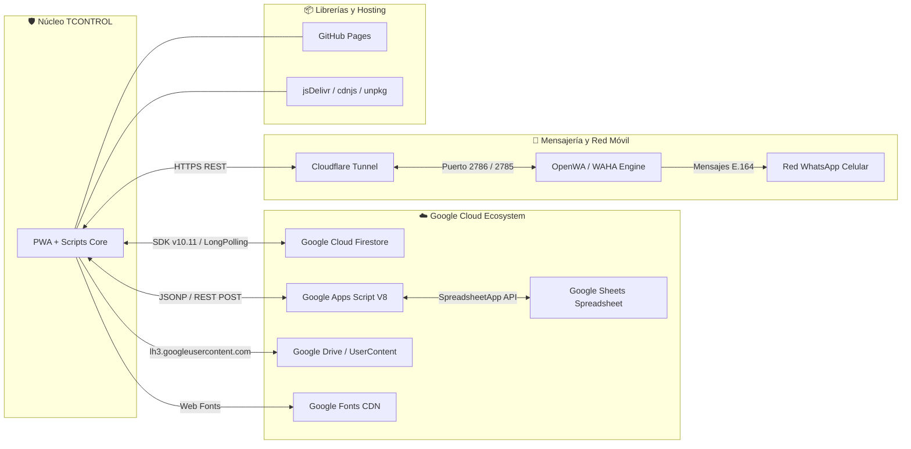

# 12 — Integraciones Externas

**Sistema:** TCONTROL — Sistema de Gestión y Control Biométrico de Asistencia (2026)  
**Fecha de Análisis:** 2026-09-29  
**Estado:** [VERIFIED]  

---

## 1. Catálogo de Integraciones



---

## 2. Detalle por Integración Externa

---

### INT-001: Google Cloud Firestore
- **Sistema:** Google Cloud Platform — Cloud Firestore (NoSQL Database).
- **Propósito:** Persistencia operacional de alta velocidad en tiempo real para marcaciones, credenciales, sesiones y estados de emergencia.
- **Trigger:** Cualquier timbrado de entrada/salida, cambio de configuración o sincronización de estado.
- **Endpoint:** `https://firestore.googleapis.com/v1/projects/tcontrol-asistencia/databases/(default)/documents` (REST) y canal WebChannel Long-Polling vía SDK JS.
- **Autenticación:** Firebase API Key web pública (`[REDACTED]`) y reglas de seguridad de Firestore.
- **Datos Enviados:** Objetos JSON de marcaciones con latitud, longitud, timestamp, foto Base64, identificadores y tokens.
- **Datos Recibidos:** Documentos de colaboradores, eventos de asistencia en tiempo real mediante `onSnapshot`, parámetros de geocerca y URL del túnel.
- **Frecuencia:** En tiempo real (baja latencia continua).
- **Configuración:** `JS/firebase_backend.js:L6-14`.
- **Dependencias:** `firebase-app-compat.js`, `firebase-firestore-compat.js`.

---

### INT-002: Google Apps Script / Google Sheets
- **Sistema:** Google Workspace — Google Apps Script & Google Sheets.
- **Propósito:** Data warehouse histórico, cálculo de fórmulas de nómina, saldo de vacaciones y respaldo a largo plazo (>60 días).
- **Trigger:**
  - Consulta de vacaciones desde la app móvil o dashboard.
  - Generación de reportes anuales con datos archivados.
  - Activadores de tiempo diarios (20:00 archivador, medianoche autocompletado).
- **Endpoint:** `https://script.google.com/macros/s/AKfycbxgmtQXWi-qDYyjT8kG6jsIEWZPbXXcHtLMaYqTlx2Allv7qkb9oe6ZGYt6lP6lCPZb/exec`.
- **Autenticación:** Parámetro secreto de aplicación `apiKey = '[REDACTED]'`.
- **Datos Enviados:** Parámetros de consulta en URL (GET JSONP) o arrays JSON masivos de registros para archivar (POST).
- **Datos Recibidos:** Arreglos de registros de asistencia de 25 columnas, saldos calculados de vacaciones (`adjudicadas`, `tomadas`, `restantes`) y listas de empleados.
- **Frecuencia:** Bajo demanda con caché SWR de 6 horas para vacaciones; tareas batch automáticas 1 vez al día.
- **Configuración:** `JS/tcontrol_core.js:L8`, `backend/apps_script/api_completa.gs:L138`.
- **Dependencias:** Conexión a internet hacia dominios `*.google.com`.

---

### INT-003: OpenWA / WAHA (WhatsApp HTTP API)
- **Sistema:** OpenWA / WhatsApp HTTP API (Instancia auto-hospedada en servidor Windows local).
- **Propósito:** Envío automatizado de mensajes de texto e imágenes con avisos de atraso, recordatorios de salida no timbrada y alertas de ausencia.
- **Trigger:** Clic de supervisión o trigger automático de hora de corte.
- **Endpoint:** `http://192.168.10.129:2785` (LAN) o `https://*.trycloudflare.com` (Público HTTPS).
- **Autenticación:** Cabecera `X-API-Key: [REDACTED]` y `Authorization: Bearer [REDACTED]`.
- **Datos Enviados:**
  ```json
  {
    "chatId": "593984660105@c.us",
    "text": "Contenido del mensaje...",
    "base64": "...", // Opcional si incluye imagen
    "caption": "..."
  }
  ```
- **Datos Recibidos:** Identificador de mensaje de WhatsApp (`messageId`), estado de entrega (`SENT`, `ACK`).
- **Frecuencia:** Esporádica / según novedades operativas del día.
- **Configuración:** `JS/openwa_service.js:L8-70`, `services/whatsapp/iniciar_tunel.py`.
- **Dependencias:** Teléfono emisor institucional conectado por QR a la sesión OpenWA.

---

### INT-004: Cloudflare Tunnel (`cloudflared.exe`)
- **Sistema:** Cloudflare Zero Trust / Quick Tunnels (`trycloudflare.com`).
- **Propósito:** Proveer un túnel seguro HTTPS público efímero hacia el puerto local `2786` (CORS Bridge), permitiendo que la PWA en HTTPS interactúe con el servidor de WhatsApp sin bloqueos de navegador.
- **Trigger:** Ejecución del archivo `iniciar_tunel_whatsapp.bat`.
- **Endpoint:** Servidor DNS dinámico `https://*.trycloudflare.com` que tuneliza hacia `http://127.0.0.1:2786`.
- **Autenticación:** No requiere cuenta de Cloudflare (Quick Tunnel anónimo).
- **Datos Enviados:** Tráfico HTTP bidireccional encriptado con TLS 1.3.
- **Frecuencia:** Proceso persistente mientras esté encendido el PC del despachador.
- **Configuración:** `services/whatsapp/iniciar_tunel.py`.
- **Dependencias:** Binario `C:\Users\tcontrol\bin\cloudflared.exe`.

---

### INT-005: CDN de Almacenamiento Fotográfico (Google User Content)
- **Sistema:** Google Drive & Googleusercontent CDN.
- **Propósito:** Servir las fotos de perfil de los colaboradores de forma ultrarrápida sin sobrecargar Firestore.
- **Trigger:** Renderizado de credenciales, listas de presentes o avatares de supervisión.
- **Mecanismo:** La función `fixFotoUrl()` (`JS/tcontrol_core.js:L22-53`) toma enlaces crudos de Google Drive (`https://drive.google.com/file/d/FILE_ID/view`) y los transforma dinámicamente en URLs directas del CDN global de Google:
  ```text
  https://lh3.googleusercontent.com/d/{FILE_ID}=w200
  ```
- **Autenticación:** Archivos de imagen configurados con acceso de lectura pública o delegada.
- **Frecuencia:** Cacheado agresivo en el navegador del cliente mediante Service Worker (Stale-While-Revalidate).
- **Dependencias:** Google Drive API CDN.

---

### INT-006: Red de Distribución de Contenido (CDNs Frontend)
- **Sistemas:** jsDelivr, Cloudflare cdnjs, Unpkg, Google Fonts.
- **Librerías Provistas:**
  - Bootstrap 5.3.0 CSS
  - FontAwesome 6.4.0 CSS & WebFonts
  - Bootstrap Icons 1.11.0
  - Leaflet 1.9.4 JS & CSS
  - Leaflet MarkerCluster 1.4.1
  - Fuentes Outfit, Inter, Plus Jakarta Sans
- **Estrategia de Contingencia:** Pre-cacheadas por el Service Worker durante el evento `install` (`sw.js:L26-32`). Si el cliente pierde la conexión o el CDN está inaccesible, se sirven directamente desde la memoria caché offline del dispositivo.
