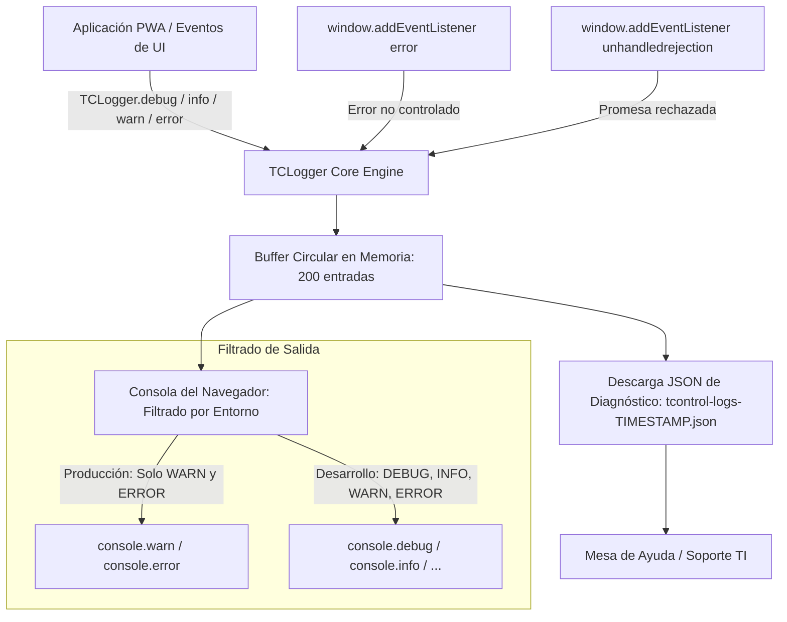

# 14 — Manejo de Errores, Logs y Resiliencia

**Sistema:** TCONTROL — Sistema de Gestión y Control Biométrico de Asistencia (2026)  
**Fecha de Análisis:** 2026-09-29  
**Estado:** [VERIFIED]  

---

## 1. Sistema Centralizado de Logging (`JS/logger.js`)

TCONTROL cuenta con un sistema de auditoría y captura de excepciones en cliente denominado **TCLogger**:



### 1.1 Características del Logger
- **Buffer Circular Acotado:** Mantiene en memoria RAM únicamente los últimos 200 eventos (`BUFFER_SIZE = 200`). Al ingresar la entrada 201, se descarta la más antigua (`buffer.shift()`), evitando fugas de memoria en smartphones.
- **Estructura de la Entrada de Log:**
  ```json
  {
    "ts": "2026-09-29T13:45:10.123Z",
    "level": "ERROR",
    "tag": "GPS_Haversine",
    "msg": "Ubicación fuera de geocerca permitida",
    "data": { "distanciaCalculada": 850, "radioMaximo": 250 }
  }
  ```
- **Captura Global Automática:**
  - `window.addEventListener('error')`: Registra automáticamente script, archivo, línea, columna y stack trace de cualquier error JS no capturado.
  - `window.addEventListener('unhandledrejection')`: Intercepta promesas asíncronas fallidas.
- **Herramienta de Diagnóstico:** Accesible desde `diagnostico.html` o consola mediante `window.TCLogger.download()`, descargando el archivo JSON de logs para análisis por soporte técnico.

---

## 2. Estrategias de Fallback y Recuperación ante Fallos

---

### FALLBACK-001: Redundancia de Persistencia (Firestore <-> Google Apps Script)
- **Problema:** Caída de los servicios de Google Cloud Firestore o bloqueo de puertos WebSockets/LongPolling en redes corporativas con firewall restrictivo.
- **Mecanismo de Resiliencia:**
  1. En `JS/tcontrol_core.js`, la función `jsonpRequest(params)` evalúa en primera instancia si Firestore está activo (`window.USE_FIREBASE && window.FirebaseBackend`).
  2. Si Firestore falla por red o timeout, o si el usuario configuró `localStorage.setItem('tcontrol_use_firebase', 'false')`, el sistema conmuta de forma transparente a peticiones **JSONP dinámicas** contra el Web App de Google Apps Script.
  3. Al retornar la conexión con Firestore, las operaciones vuelven a priorizar la base en tiempo real.

---

### FALLBACK-002: Resiliencia de Consultas de Vacaciones (Caché SWR de 6 Horas)
- **Problema:** Google Apps Script puede experimentar tiempos de respuesta lentos (8 a 15 segundos) o timeouts (`Exceeded maximum execution time`) al procesar fórmulas complejas en la hoja `CALCULAR_vacaciones`.
- **Mecanismo de Resiliencia (`JS/firebase_backend.js:L186-330`):**
  1. Si `params.force` no está activado, consulta primero `localStorage` buscando la clave `tcontrol_vacaciones_cache_v3`.
  2. Si la edad del caché es menor a 6 horas (`ageMs < 6 * 3600 * 1000`) y contiene datos válidos, **retorna inmediatamente** sin hacer peticiones de red (tiempo de respuesta < 5 ms).
  3. Si debe consultar a Sheets, establece un timeout estricto de 15 segundos.
  4. Si Sheets devuelve error o se agota el tiempo, el bloque `catch` recupera la última versión en caché conocida (`window._kpiVacacionesCache` o `tcontrol_vacaciones_cache_v2`), garantizando que el colaborador nunca vea su pantalla de perfil en blanco.

---

### FALLBACK-003: Cascada de Endpoints de WhatsApp (Multi-Ruta OpenWA / WAHA)
- **Problema:** Diferentes versiones del servidor OpenWA o WAHA exponen los endpoints de envío bajo distintas rutas de API REST (`v0.23+`, `v5+`, o legacy).
- **Mecanismo de Resiliencia (`JS/openwa_service.js:L591-628`):**
  Al enviar un mensaje de texto, el servicio ejecuta una cascada de intentos automáticos si recibe código HTTP 404:
  1. *Intento 1:* `POST /api/sessions/{session}/messages/send-text`
  2. *Intento 2 (Fallback):* `POST /api/sendText`
  3. *Intento 3 (Fallback):* `POST /api/messages/sendText`
  
  Para el envío de imágenes (`JS/openwa_service.js:L711-805`):
  1. *Intento 1:* `POST /api/sessions/{session}/messages/send-image` con `{ base64, mimetype, caption }`
  2. *Intento 2:* `POST /api/sessions/{session}/messages/send-image` con `{ file: { mimetype, data } }`
  3. *Intento 3:* `POST /api/sendImage`
  4. *Intento 4:* `POST /api/sendImageBase64`
  5. *Intento 5:* `POST /api/sessions/{session}/messages/send-file`

---

### FALLBACK-004: Prevención y Conmutación de Contenido Mixto (HTTPS -> HTTP)
- **Problema:** En dispositivos móviles, los navegadores impiden por diseño que una web segura (`https://asistencia.tcontrolsa.com`) consulte un servidor HTTP en la red local (`http://192.168.10.129:2785`).
- **Mecanismo de Resiliencia (`JS/openwa_service.js:L344-374`):**
  1. La función `_esInseguroEnHttps(url)` detecta si la URL configurada comienza con `http://`.
  2. Antes de realizar el fetch (que generaría un error de consola irrecuperable), consulta el documento `configuracion/whatsapp` en Firestore para refrescar la URL HTTPS activa generada por el túnel Cloudflare (`https://*.trycloudflare.com`).
  3. Si la URL refrescada es HTTPS, continúa con el envío exitosamente.
  4. Si no hay túnel activo, presenta un mensaje de instrucción claro al usuario para que levante el túnel con `iniciar_tunel_whatsapp.bat`.

---

### FALLBACK-005: Fallback Criptográfico de Contraseñas (Web Crypto -> JS Puro)
- **Problema:** Navegadores antiguos o conexiones en entornos no seguros deshabilitan `window.crypto.subtle`.
- **Mecanismo de Resiliencia (`JS/tcontrol_core.js:L56-135`):**
  Si `window.crypto.subtle.digest` arroja error o es nulo, la función `hashPassword` ejecuta inmediatamente la función matemática `sha256PureJs(ascii)`, calculando el digesto SHA-256 mediante operaciones a nivel de bit (`bitwise XOR, AND, rightRotate`) sin requerir ninguna biblioteca externa.

---

### FALLBACK-006: Contingencia Offline de la PWA (Service Worker)
- **Problema:** Colaboradores timbrando en zonas de sótano, galpones industriales o transporte sin cobertura celular.
- **Mecanismo de Resiliencia (`sw.js:L148-175`):**
  1. El Service Worker intercepta las peticiones de navegación.
  2. Si no hay respuesta de red, responde con la versión en caché de `index.html`.
  3. Si la caché del shell se encontrara corrupta, responde con `offline.html`, una interfaz autónoma con diseño corporativo que informa al usuario que sus datos se conservarán y debe reconectar a la red.
