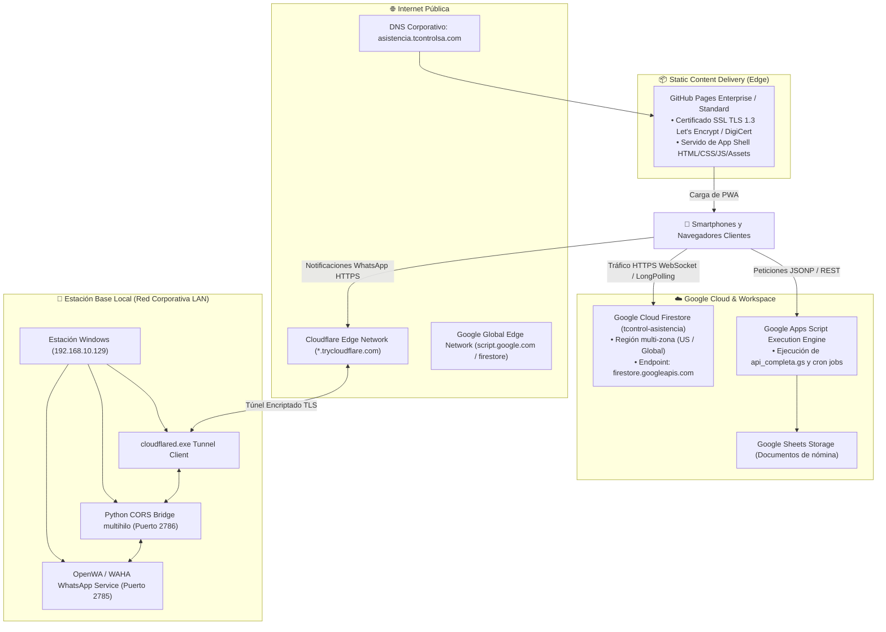

# 16 — Infraestructura, Redes y Servicios de Despliegue

**Sistema:** TCONTROL — Sistema de Gestión y Control Biométrico de Asistencia (2026)  
**Fecha de Análisis:** 2026-09-29  
**Estado:** [VERIFIED]  

---

## 1. Topología de Infraestructura

TCONTROL opera en un modelo **Híbrido Distribuido Multi-Nube con Nodo Local (Edge-Cloud-OnPremise)**:

---

## 2. Componentes de Infraestructura por Nivel

### 2.1 Capa de Alojamiento y Dominio (Web Hosting)
- **Proveedor:** GitHub Pages.
- **Dominio Canónico:** `asistencia.tcontrolsa.com` (`CNAME:L1`).
- **Certificado SSL/TLS:** Administrado automáticamente por GitHub Pages (Let's Encrypt / DigiCert con renovación automática, TLS 1.2 / TLS 1.3 forzado).
- **Enrutamiento:** Redirección estática hacia `index.html`. Toda la navegación interna se resuelve en cliente mediante hashes de URL (`index.html#almuerzo`, `#history`, `#extras`) y variables de estado.

---

### 2.2 Capa de Base de Datos y Persistencia en la Nube
- **Google Cloud Firestore:**
  - **Proyecto:** `tcontrol-asistencia`
  - **Identificador de la App Web:** `1:400445408344:web:1ef803575febd8d311362d`
  - **Almacenamiento:** NoSQL escalable con sincronización en tiempo real vía WebChannels.
  - **Reglas de Red:** Acceso desde cualquier IP pública vía HTTPS con validación de API Key y Firestore Security Rules v2.
- **Google Apps Script & Sheets:**
  - **Plataforma:** Google Workspace V8 Serverless Environment.
  - **Almacenamiento de Ficheros:** Google Drive corporativo de la organización.
  - **Disponibilidad:** 99.9% respaldada por Google Cloud Platform.

---

### 2.3 Capa Local de Mensajería WhatsApp (On-Premise Node)
- **Servidor Físico:** Estación de trabajo en la sede de TCONTROL con sistema operativo Windows.
- **Dirección IP en Red LAN:** `192.168.10.129` (IP estática / DHCP reservado).
- **Puertos de Red Utilizados:**
  - **Puerto `2785`:** Puerto interno de la instancia de OpenWA / WAHA (escucha peticiones HTTP locales).
  - **Puerto `2786`:** Puerto local del proxy inversor `whatsapp_cors_bridge.py` en `127.0.0.1`.
- **Túnel Seguro Inverso (Cloudflare Tunnel):**
  - Binario: `C:\Users\tcontrol\bin\cloudflared.exe`.
  - Protocolo: Salida saliente (Outbound only) mediante protocolo QUIC / HTTP/2 hacia servidores de borde de Cloudflare.
  - No requiere apertura de puertos en el router corporativo ni asignación de IP pública fija (NAT Traversal).
  - Genera dominios públicos efímeros bajo el subdominio `*.trycloudflare.com` con terminación SSL/TLS administrada por Cloudflare.

---

## 3. Matriz de Puertos, Protocolos y Tráfico de Red

| Origen | Destino | Puerto | Protocolo | Tipo de Tráfico | Propósito |
|---|---|---|---|---|---|
| Clientes Web | `asistencia.tcontrolsa.com` | `443` | HTTPS (TLS 1.3) | Saliente TCP | Descarga de App Shell PWA |
| Clientes Web | `firestore.googleapis.com` | `443` | HTTPS / LongPolling | Saliente TCP | Sincronización de base de datos en tiempo real |
| Clientes Web | `script.google.com` | `443` | HTTPS / JSONP | Saliente TCP | Consultas de vacaciones y reportes |
| Clientes Web | `lh3.googleusercontent.com` | `443` | HTTPS | Saliente TCP | Descarga de fotos de perfil de colaboradores |
| Clientes Web | `*.trycloudflare.com` | `443` | HTTPS | Saliente TCP | Envío de notificaciones WhatsApp desde la PWA |
| Cloudflare Edge | `cloudflared.exe` | Varios (QUIC) | UDP / TCP | Saliente tunelizado | Transporte del túnel inverso |
| `cloudflared.exe` | `whatsapp_cors_bridge.py` | `2786` | HTTP | Localhost (`127.0.0.1`) | Despacho al proxy CORS |
| `whatsapp_cors_bridge.py` | Servidor OpenWA | `2785` | HTTP | LAN (`192.168.10.129`)| Entrega final al motor de mensajería |

---

## 4. Requisitos para Reproducción de Infraestructura

Para reconstruir este entorno en una nueva infraestructura se requiere:
1. **Hosting Web:** Servidor Nginx, Apache, Cloudflare Pages, Vercel o GitHub Pages con soporte HTTPS y configuración de MIME types para `.json`, `.js`, `.css`, `.png`.
2. **Instancia Firebase:** Proyecto en Google Cloud con Cloud Firestore habilitado y despliegue del archivo `firestore.rules`.
3. **Instancia Google Workspace:** Hoja de cálculo maestra en Google Sheets con las 25 columnas oficiales y despliegue del código `api_completa.gs` como Web App pública.
4. **Instancia WhatsApp:** Motor OpenWA/WAHA en Docker o binario ejecutable en el puerto 2785, junto con `cloudflared` configurado para tunelizar hacia el puerto 2786.
