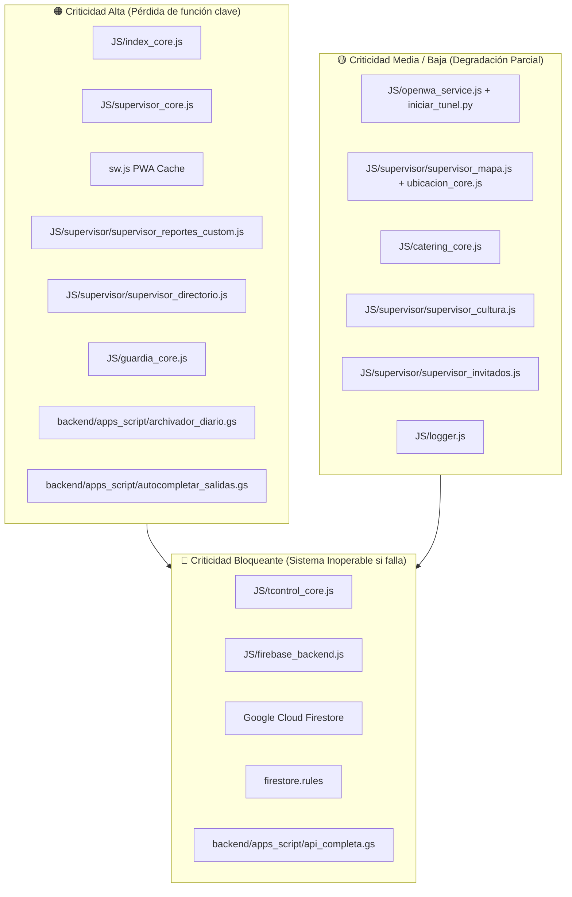

# 20 — Matriz de Dependencias (Dependency Matrix)

**Sistema:** TCONTROL — Sistema de Gestión y Control Biométrico de Asistencia (2026)  
**Fecha de Análisis:** 2026-09-29  
**Estado:** [VERIFIED]  

---

## 1. Matriz de Dependencias por Componente

| Componente / Archivo | Depende de (Prerrequisitos) | Utilizado por (Consumidores) | Nivel de Criticidad | Justificación de Criticidad |
|---|---|---|---|---|
| **`JS/tcontrol_core.js`** | Web Cryptography API (`crypto.subtle`) o CPU JS, Geolocation API | Todos los módulos (`index_core.js`, `supervisor_core.js`, `guardia_core.js`, `catering_core.js`, `admin_config_core.js`) | **CRÍTICA (BLOQUEANTE)** | Define la configuración global maestra, el cálculo de geocerca Haversine, el hash SHA-256 de PINs y los formateadores de horas y fechas. |
| **`JS/firebase_backend.js`** | Firebase JS SDK v10.11.0 (`firebase.firestore()`), `tcontrol_core.js` | `index_core.js`, `supervisor_core.js`, `guardia_core.js`, `catering_core.js`, `admin_config_core.js` | **CRÍTICA (BLOQUEANTE)** | Fachada universal de persistencia y operaciones en tiempo real en Cloud Firestore. |
| **`JS/index_core.js`** | `tcontrol_core.js`, `firebase_backend.js`, `openwa_service.js`, `HTMLCanvasElement`, MediaDevices (Cámara) | `index.html` (PWA Colaborador) | **CRÍTICA** | Gestiona el 100% de la experiencia móvil del empleado (marcaciones, fotos, GPS, almuerzo). |
| **`JS/supervisor_core.js`** | `tcontrol_core.js`, `firebase_backend.js`, Submódulos `supervisor/*.js`, Bootstrap 5.3 | `supervisor.html` | **CRÍTICA** | Núcleo de control de asistencia para RRHH, cálculo de jornada, justificaciones y monitoreo en vivo. |
| **`JS/supervisor/supervisor_reportes_custom.js`** | `supervisor_core.js`, SheetJS (`xlsx.full.min.js`), jsPDF + autoTable | `supervisor.html` (Pestaña Reportes) | **ALTA** | Exportación de horas para nómina y liquidación de sueldos. |
| **`JS/supervisor/supervisor_whatsapp.js`** | `supervisor_core.js`, `openwa_service.js` | `supervisor.html` (Pestaña WhatsApp) | **MEDIA** | Canal de mensajería para alertas y notificaciones a colaboradores. |
| **`JS/supervisor/supervisor_directorio.js`** | `supervisor_core.js`, `firebase_backend.js` | `supervisor.html` (Pestaña Directorio) | **ALTA** | Altas de colaboradores, asignación de áreas y archivo pasivo de desvinculados (LOPDP). |
| **`JS/supervisor/supervisor_mapa.js`** | `supervisor_core.js`, Leaflet 1.9.4, OpenStreetMap tiles | `supervisor.html` (Pestaña Mapa) | **MEDIA** | Visualización espacial del personal en campo. |
| **`JS/supervisor/supervisor_invitados.js`** | `supervisor_core.js`, `firebase_backend.js` | `supervisor.html` (Pestaña Invitados) | **BAJA** | Gestión de alimentación para visitas externas. |
| **`JS/supervisor/supervisor_emergencias.js`** | `supervisor_core.js`, `firebase_backend.js` | `supervisor.html` (Pestaña Emergencias) | **ALTA (SITUACIONAL)** | Tablero de mando para emergencias físicas y simulacros. |
| **`JS/supervisor/supervisor_cultura.js`** | `supervisor_core.js`, `firebase_backend.js` | `supervisor.html` (Pestaña Cultura) | **BAJA** | Gestión de trivias corporativas. |
| **`JS/guardia_core.js`** | `firebase_backend.js`, Geolocation API | `guardia.html` | **ALTA** | Registro de contingencia para personal sin teléfono en garita. |
| **`JS/catering_core.js`** | `tcontrol_core.js`, `firebase_backend.js` | `catering.html` | **MEDIA** | Control de raciones en cocina para evitar doble entrega. |
| **`JS/admin_config_core.js`** | `tcontrol_core.js`, `firebase_backend.js` | `admin_config.html` | **ALTA** | Modificación de geocercas centrales y reseteo masivo de PINs. |
| **`JS/ubicacion_core.js`** | Leaflet 1.9.4, Leaflet MarkerCluster, `firebase_backend.js` | `ubicacion.html` | **MEDIA** | Radar satelital independiente con auto-recarga cada 60s. |
| **`JS/openwa_service.js`** | `fetch` API, Servidor OpenWA (LAN) o Cloudflare Tunnel (HTTPS) | `index_core.js`, `supervisor_whatsapp.js` | **MEDIA** | Motor de normalización y envío de WhatsApp. |
| **`JS/logger.js`** | `window.addEventListener('error')`, `unhandledrejection` | `diagnostico.html`, consola global | **BAJA** | Buffer circular de soporte técnico. |
| **`sw.js`** | Service Worker API, Cache Storage API | Todos los navegadores de clientes | **ALTA** | Disponibilidad offline, instalación PWA y caché de librerías. |
| **`backend/apps_script/api_completa.gs`** | Google Workspace V8, Google Sheets API | `firebase_backend.js`, `index_core.js`, `supervisor_core.js` | **CRÍTICA** | Data warehouse histórico, cálculo de vacaciones y respaldo legal. |
| **`backend/apps_script/archivador_diario.gs`** | `api_completa.gs`, Time-driven trigger GAS, Firestore REST API | Automatización en segundo plano (20:00) | **CRÍTICA** | Purga de Firestore y archivado de registros de más de 60 días. |
| **`backend/apps_script/autocompletar_salidas.gs`** | `api_completa.gs`, Time-driven trigger GAS | Automatización en segundo plano (Medianoche) | **ALTA** | Regularización de jornadas inconclusas para nómina. |
| **`backend/apps_script/mantenimiento_registros.gs`**| `api_completa.gs` | Activación manual o programada en Google Workspace | **ALTA** | Deduplicación de registros y autorización automática de horas extras. |
| **`services/whatsapp/iniciar_tunel.py`** | Python 3, `cloudflared.exe`, `whatsapp_cors_bridge.py`, Firestore REST API | `openwa_service.js` (cuando se accede vía HTTPS) | **MEDIA** | Genera túnel seguro HTTPS para conectar clientes remotos con WhatsApp LAN. |
| **`firestore.rules`** | Google Cloud Security Rules Engine | Base de datos Cloud Firestore | **CRÍTICA** | Garantiza la integridad de datos y previene borrados maliciosos o accidentales. |

---

## 2. Diagrama de Criticidad de la Plataforma

