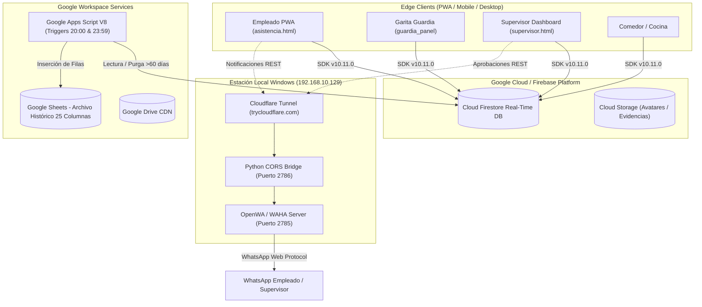

# MASTER RECONSTRUCTION SPECIFICATION (ESPECIFICACIÓN MAESTRA DE RECONSTRUCCIÓN)

> **Proyecto:** Sistema Biométrico de Asistencia, Comedor y Novedades TCONTROL  
> **Versión del Documento:** 1.0.0 (Master Release)  
> **Fecha de Emisión:** Septiembre 2026  
> **Autor:** Principal Software Architect & Reverse Engineering Team  
> **Estado:** APROBADO PARA RECONSTRUCCIÓN (Pendiente de Autorización de Usuario)  

---

## 1. OBJETIVO DEL SISTEMA

Proporcionar a **TCONTROL S.A.** una solución integral, biométrica y distribuida para la gestión en tiempo real del personal operativo y administrativo en sus plantas y proyectos. El sistema garantiza la puntualidad laboral, el cumplimiento de la jornada laboral oficial ecuatoriana, el aprovisionamiento exacto del servicio de alimentación (comedor/catering), el registro fotográfico inmutable de identidad y la trazabilidad absoluta de horas suplementarias y permisos, integrando notificaciones inmediatas a supervisores mediante WhatsApp y persistencia histórica en la nube.

---

## 2. ALCANCE TÉCNICO Y OPERATIVO

El sistema abarca 5 módulos funcionales interconectados:
1. **PWA Móvil de Colaborador:** Registro de asistencia (Entrada/Salida) con verificación de geocerca (< 250m) y captura biométrica facial (selfie). Selección de menú de almuerzo antes de las 09:30 AM.
2. **Consola de Garita y Contingencia:** Módulo para guardias de seguridad que permite registrar marcaciones asistidas a colaboradores sin smartphone o con problemas de batería/conectividad.
3. **Panel de Gestión de Cocina (Catering):** Consulta en tiempo real de conteo de almuerzos solicitados y confirmación de despacho al momento del retiro del plato.
4. **Dashboard de Supervisión y RRHH:** Monitoreo en vivo de ausentismos, atrasos matutinos, aprobación de justificaciones de horas extras, auditoría de logs y sincronización de vacaciones.
5. **Microservicio Local de WhatsApp y Cloud Archiver:** Backend de mensajería automática vía Baileys/OpenWA expuesto por Cloudflare Tunnel y workers diarios en Google Apps Script para archivado histórico y autocompletado de jornadas.

---

## 3. ARQUITECTURA DEL SISTEMA

El sistema opera bajo un patrón **Serverless Edge PWA con Capa Híbrida Local/Nube**:

---

## 4. STACK TECNOLÓGICO Y VERSIONES VERIFICADAS

- **Frontend Core:** HTML5 Semántico, JavaScript ES6+ Vanilla (sin frameworks pesados), CSS3 con variables personalizadas (`:root`).
- **Librerías CDN Externas:**
  - Bootstrap v5.3.2 (Estilos base y modales interactivos)
  - FontAwesome v6.4.2 (Iconografía operativa)
  - Leaflet v1.9.4 (Cartografía y visualización GPS en tiempo real)
- **Base de Datos Transaccional:** Firebase SDK v10.11.0 (Cloud Firestore en modo web modular).
- **Backend Batch & Data Warehouse:** Google Apps Script Runtime V8 acoplado a Google Sheets API.
- **Microservicio de Mensajería:** Node.js (OpenWA/WAHA), Python 3.10+ (CORS proxy `http.server`), Cloudflare Tunnel CLI (`cloudflared`).

---

## 5. CATÁLOGO MAESTRO DE FUNCIONALIDADES

| Código | Funcionalidad | Actor Principal | Componente Fuente |
|---|---|---|---|
| **FN-01** | Enrolamiento y Vinculación de Dispositivo | Colaborador | `tcontrol_core.js`, `asistencia.html` |
| **FN-02** | Marcación Biométrica Facial con Geolocalización | Colaborador | `asistencia.html`, `canvas` biométrico |
| **FN-03** | Reserva de Almuerzo Diaria (Corte 09:30 AM) | Colaborador | `asistencia.html`, `consumo_almuerzos` |
| **FN-04** | Marcación Asistida en Garita de Seguridad | Guardia | `guardia_panel.js`, `asistencia.html` |
| **FN-05** | Despacho y Registro de Comedor | Catering | Vista de Comedor |
| **FN-06** | Monitoreo en Vivo de Asistencias y Atrasos | Supervisor | `supervisor.html`, listener Firestore |
| **FN-07** | Solicitud y Aprobación de Horas Suplementarias | Empleado / Supervisor | Modal de Overtime, `supervisor.html` |
| **FN-08** | Cierre Automático Nocturno de Jornadas | Proceso Batch | Google Apps Script (Trigger Medianoche) |
| **FN-09** | Archivo y Purga de Registros > 60 Días | Proceso Batch | Google Apps Script (Trigger 20:00) |
| **FN-10** | Notificación Automatizada vía WhatsApp | Sistema | Endpoint de Túnel Cloudflare / OpenWA |

---

## 6. FLUJOS DE NEGOCIO PRINCIPALES

### Flujo F-01: Marcación de Entrada del Colaborador
1. **Inicio:** Empleado abre la PWA. El sistema valida el token de dispositivo en `localStorage`.
2. **GPS:** Se obtienen coordenadas de geolocalización del navegador. Se calcula la distancia con la fórmula Haversine contra la ubicación de planta (-2.148..., -79.919...).
3. **Validación:** Si distancia > 250m y no tiene excepción, se bloquea la marcación y se muestra el mapa.
4. **Biometría:** Si está dentro del rango, se activa la cámara, se captura selfie y se extrae imagen en Base64.
5. **Clasificación:** Si la hora es posterior a 07:45 AM, se marca como `ATRASO`; si no, `PUNTUAL`.
6. **Persistencia:** Se escribe el documento determinista `YYYY-MM-DD_EMP-XXXX` en la colección `registros`.
7. **Notificación:** Si hay atraso, se dispara mensaje a WhatsApp al supervisor con los minutos de retraso.

---

## 7. REGLAS DE NEGOCIO CRÍTICAS

- **BR-001 (Geocerca):** Radio de tolerancia máximo de **250 metros** desde las coordenadas maestras de la empresa mediante la fórmula Haversine (`R = 6371` km).
- **BR-002 (Horario Matutino):** Entrada oficial a las **07:30 AM**. Período de gracia hasta las **07:45 AM**. Posterior a las 07:45 AM se computa atraso estricto.
- **BR-003 (Horario Vespertino):** Fin de jornada oficial de lunes a viernes a las **16:15 PM**. Fin de jornada en sábados a las **15:15 PM**.
- **BR-004 (Corte de Comedor):** La reserva de almuerzos se deshabilita automáticamente a las **09:30 AM**. Ningún pedido puede procesarse después de este corte.
- **BR-005 (Horas Suplementarias):** Toda permanencia que supere la salida oficial en más de **45 minutos** requiere obligatoriamente justificación y aprobación de jefatura.
- **BR-006 (Clave Determinista de Firestore):** Los documentos de asistencia se indexan con el ID obligatorio `${YYYY-MM-DD}_EMP-${id}` para garantizar unicidad y evitar duplicados en el mismo día.

---

## 8. MODELO DE DATOS NORMALIZADO

### Colecciones Principales en Firestore
1. **`empleados`:**
   - Document ID: `EMP-XXXX`
   - Campos: `id` (string), `nombre` (string), `cargo` (string), `area` (string), `pin_hash` (string SHA-256), `estado` ("ACTIVO"|"DESVINCULADO"), `telefono` (string), `foto_url` (string).
2. **`registros`:**
   - Document ID: `YYYY-MM-DD_EMP-XXXX`
   - Campos: `fecha` (YYYY-MM-DD), `empleado_id` (string), `nombre` (string), `entrada` (objeto: `{ hora, coordenadas, foto, estado_llegada, operador }`), `salida` (objeto: `{ hora, coordenadas, foto, tipo_salida, salida_automatica }`), `horas_extras` (objeto opcional).
3. **`consumo_almuerzos`:**
   - Document ID: `YYYY-MM-DD_EMP-XXXX`
   - Campos: `fecha`, `empleado_id`, `opcion_menu`, `estado` ("RESERVADO"|"CONSUMIDO"|"CANCELADO"), `hora_reserva`, `hora_consumo`.
4. **`dispositivos`:**
   - Document ID: Token UUID generado en cliente.
   - Campos: `empleado_id`, `fecha_enrolamiento`, `user_agent`, `estado` ("VINCULADO"|"REVOCADO").

### Esquema Histórico en Google Sheets (25 Columnas A-Y)
- `A: ID_Registro`, `B: Fecha`, `C: ID_Empleado`, `D: Nombre`, `E: Area`, `F: Cargo`, `G: Hora_Entrada`, `H: Lat_Entrada`, `I: Lng_Entrada`, `J: Distancia_Entrada`, `K: Estado_Llegada`, `L: Minutos_Atraso`, `M: Foto_Entrada_URL`, `N: Operador_Entrada`, `O: Hora_Salida`, `P: Lat_Salida`, `Q: Lng_Salida`, `R: Distancia_Salida`, `S: Tipo_Salida`, `T: Salida_Automatica`, `U: Foto_Salida_URL`, `V: Horas_Trabajadas`, `W: Horas_Extras`, `X: Estado_Horas_Extras`, `Y: Observaciones`.

---

## 9. CONTRATOS DE INTEGRACIÓN Y APIS

- **Google Apps Script Web App:**
  - `POST /exec`: Recepción de payloads para archivo histórico masivo y sincronización de saldos de vacaciones.
- **Local WhatsApp Bridge (OpenWA / WAHA):**
  - `POST /api/sendText`: `{ "chatId": "593XXXXXXXXX@c.us", "text": "Mensaje formal de notificación" }`
- **Túnel Cloudflare:**
  - Redirección HTTPS externa segura hacia `http://127.0.0.1:2786` con cabeceras CORS permisivas para el dominio de GitHub Pages.

---

## 10. ESPECIFICACIÓN DE FRONTEND Y PWA

- **Arquitectura de Vistas:** Single Page Application basada en contenedores semánticos (`
`) con cambio de visibilidad por clases CSS (`d-none`).
- **Manifiesto PWA:** `manifest.json` con `display: standalone`, `theme_color: #1e3a8a`, iconos de 192x192 y 512x512.
- **Service Worker (`sw.js`):** Estrategia Network-First con fallback a Cache Storage para recursos estáticos del núcleo (`index.html`, CSS, librerías locales).
- **Control de Cámara:** Captura nativa vía `navigator.mediaDevices.getUserMedia` proyectada a un `<video>` y procesada en un `<canvas>` oculto escalado a 640x480 con compresión JPEG 0.7.

---

## 11. MODELO DE SEGURIDAD Y PRIVACIDAD

1. **Hashing Criptográfico de PIN:** El PIN de 4 dígitos nunca viaja ni se guarda en texto claro; se hashea con SHA-256 en el cliente utilizando Web Crypto API o algoritmo puro JS como contingencia.
2. **Vinculación Criptográfica de Dispositivo:** Cada smartphone queda registrado mediante un token UUID único persistido en `localStorage` y validado contra Firestore.
3. **Protección LOPDP (Ecuador):** Las fotografías biométricas no se almacenan como descriptores biométricos vectoriales de terceros, sino como imágenes comprimidas de auditoría visual interna con expiración de retención de 60 días.
4. **Ofuscación de Secretos:** Todas las credenciales maestras y tokens API deben extraerse del código fuente e inyectarse mediante variables de entorno de compilación o backend proxy.

---

## 12. INFRAESTRUCTURA Y TOPOLOGÍA DE DESPLIEGUE

- **Hosting Público:** GitHub Pages con dominio propio HTTPS (`asistencia.tcontrolsa.com`).
- **Base de Datos en la Nube:** Google Cloud Firestore (Región `us-central1` o `southamerica-east1`).
- **Almacenamiento Histórico:** Google Cloud Workspace (Google Drive + Google Sheets corporativo).
- **Servidor Periférico de Mensajería:** PC local en garita/oficina técnica (`192.168.10.129`, Windows 11 Pro) ejecutando OpenWA en puerto 2785 y Cloudflare Tunnel CLI.

---

## 13. DEPENDENCIAS EXTERNAS E INTERNAS

1. **Node.js Runtime** (para OpenWA en estación local).
2. **Python 3.x** (para script puente de cabeceras CORS `http.server`).
3. **Cloudflare Tunnel Daemon** (`cloudflared.exe` versión 2024+).
4. **Google Apps Script V8 Engine**.
5. **CDNs de Terceros:** Cloudflare CDNJS (Bootstrap, Leaflet, FontAwesome) y Google Fonts (Inter).

---

## 14. PRINCIPALES RIESGOS Y DEUDA TÉCNICA A RESOLVER EN RECONSTRUCCIÓN

- **Eliminar IPs Hardcoded:** Retirar la IP `192.168.10.129` del código cliente.
- **Reemplazar Clave de Guardia Estática:** Erradicar `CLAVE_GUARDIA = "TCONTROL2026"` en favor de autenticación individual.
- **Externalizar Calendario de Feriados:** Ampliar el catálogo de feriados más allá del año 2026 mediante base de datos dinámica.
- **Desacoplar ADMIN_ID:** Reemplazar `ADMIN_ID = "1058"` por un sistema de roles flexible basado en base de datos.

---

## 15. GAPS Y REQUERIMIENTOS DE CONFIRMACIÓN

- `[REQUIRES_CONFIRMATION]` Definir si en la reconstrucción se mantendrá la máquina local Windows para WhatsApp o se migrará a un proveedor en la nube oficial (Meta Cloud API / Twilio).
- `[REQUIRES_CONFIRMATION]` Validar si el límite de geocerca de 250 metros debe ser configurable por cada colaborador (para cuadrillas de campo o técnicos en proyectos externos).

---

## 16. CRITERIOS DE ACEPTACIÓN FORMALES

Toda reimplementación se considerará exitosa únicamente si aprueba el 100% de los escenarios BDD definidos en [24_ACCEPTANCE_CRITERIA.md](file:///c:/Users/tcontrol/Documents/GitHub/Asistencia/docs/reverse-engineering/24_ACCEPTANCE_CRITERIA.md), destacando:
- Precisión en cálculo de atraso (>07:45 AM).
- Bloqueo geográfico estricto (>250m).
- Cierre inviolable de pedidos de almuerzo (09:30 AM).
- Autocompletado nocturno de salidas olvidadas a las 16:15 / 15:15.
- Transvase histórico fiel a Google Sheets a los 60 días.

---

## 17. PLAN MAESTRO DE RECONSTRUCCIÓN PASO A PASO

Cuando sea autorizada, la reconstrucción seguirá las siguientes fases:

1. **Fase 1: Configuración de Entorno y Variables:**
   - Creación del nuevo repositorio con Vite/Modern Vanilla JS.
   - Definición de `.env.example` y parametrización de Firebase y endpoints de WhatsApp.
2. **Fase 2: Core de Seguridad y Autenticación:**
   - Módulo criptográfico universal SHA-256.
   - Sistema de roles (Empleado, Guardia, Supervisor, Cocina, Admin).
3. **Fase 3: Módulo de Asistencia Biométrico (PWA):**
   - Servicio de geolocalización Haversine con fallback.
   - Captura de cámara y canvas optimizado.
   - Persistencia determinista en Firestore.
4. **Fase 4: Módulo de Comedor y Catering:**
   - Panel de comensal con bloqueo por reloj a las 09:30 AM.
   - Panel de despacho de cocina en tiempo real.
5. **Fase 5: Módulo de Guardia y Supervisión:**
   - Panel de garita con autenticación segura.
   - Consola de supervisión de atrasos, ausentismos y horas suplementarias.
6. **Fase 6: Workers y Cloud Functions:**
   - Sustitución o modernización de triggers Apps Script (autocompletado 23:59 y archivador de 60 días).
7. **Fase 7: Shadow Running (Pruebas en Paralelo):**
   - Despliegue en staging y ejecución en paralelo durante 14 días contra el sistema actual.
8. **Fase 8: Go-Live y Desconexión del Sistema Legacy.**
